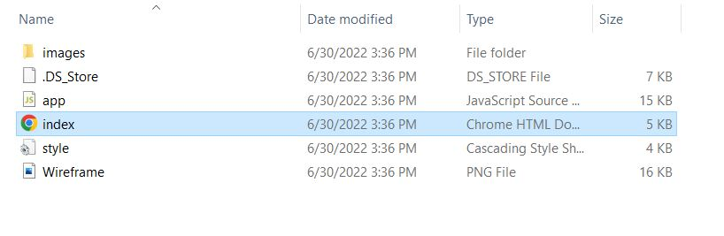

# Space Wars

Space Wars is a point and click text based single player game where the main goal is destroy all alien ships invading Earth. The player will serve as the Captain of the humankind's ship and decide each round whether to attack or retreat. The player and alien ship attacks are automatic and the outcome of the battle will be recorded in the battle log. The initial round of the game serves as a tutorial for the player to understand the flow of the game. At the end of the game, the player can decide to redo the tutorial or to move on to the real game. The real game will restart the game with additional features. If at any point the player ship's hull (health) hits 0, the game is over.

## Demo of the Tutorial

There is a built in instructions hover on the general flow of the game. The tutorial round consists of a fleet of 6 ships. After defeating all 6 ships, the player can choose to play the tutorial again or start the real game. On the bottom of the main game board, there is a log recording the outcome of each fight.

## Features

- Mouse over instructions
- Battle and Retreat buttons to continue the game or quit
- Battle log that records the outcome of each round
- Stats tracker for player stats, alien stats, scrap resources, round number, and total ships destroyed
- Shop to purchase heals and powerups
- One time missle to do massive damage
- Alien boss ship (To be implemented)

## Technologies Used

- HTML
- CSS
- JavaScript

## Installation Instructions

Currently, the game can only be played locally on the users computer. In order to do that, you the best way is to download the file from the [github](https://github.com/Yaosaur/Space_Battle_starter_code) repository.

Once downloaded, please extract the zip files using a freeware such [7-Zip](https://www.7-zip.org/). Afterwards, double click on the index file in the folder and you are ready to play.

## Credits

- Sprites from DreamRunner [PixelJoint](https://pixeljoint.com/)
- Gifs from [Giphy](https://giphy.com/)
